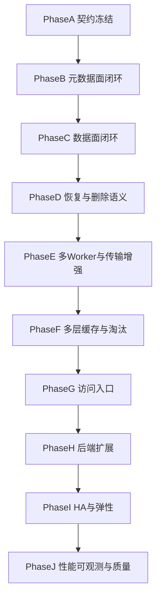

# FluxCache Issue Roadmap

> 本文件是 FluxCache 当前唯一权威 roadmap。  
> 为降低迁移成本，历史文件名中的 `P1/P2/P3` 前缀保留，但阶段组织已改为 `Phase A ~ Phase J`。  
> 旧的“大一统 issue”如 `P1-05`、`P1-08`、`P1-14`、`P1-15` 已拆为更适合 AI Coding 的子 issue。

设计参考：
- [Block ID 与文件布局](../design/block-id-and-file-layout.md)
- [Master 元数据设计](../design/metadata-design.md)
- [Client SDK 设计](../design/client-sdk-design.md)
- [HA Journal 设计](../design/ha-journal-design.md)
- [安全降级设计](../design/degradation-policy-design.md)

## Roadmap 原则

- 先完成 `单 Master + 单 Worker + LocalFS + write-through + mtime 校验` 的最小闭环。
- 契约先冻结，再做入口、性能和高级能力扩展。
- 集成 issue 只做拼装验证，不再承担核心实现。
- 所有验收标准都应可通过单测、假实现、计数器或可控测试桩稳定验证。

## 编号与标题约定

- 历史编号前缀 `P1 / P2 / P3` 保留，用于兼容已有文件名与讨论语境。
- 当前真正的执行阶段以 `Phase A ~ Phase J` 为准。
- 若一个旧 issue 被拆分，使用后缀字母区分子 issue，如 `P1-05A`、`P1-05B`、`P1-05C`。
- 标题优先使用“能力边界 + 最小实现 / 验证 / 设计 Spike”的写法，避免“骨架”这类过于宽泛的词。
- `E2E` issue 只负责拼装验证，不承担新的核心实现。

## 全局依赖图



## Phase A：契约冻结

目标：固定最小数据模型、UFS 抽象、配置与 RPC 契约。

| Issue | 标题 | 依赖 | 分级 |
|---|---|---|---|
| [P1-01](./P1-01-project-scaffolding.md) | 项目脚手架与构建系统 | 无 | P1 |
| [P1-16](./P1-16-core-types.md) | 核心类型定义 | P1-01 | P1 |
| [P1-02](./P1-02-config-system.md) | 配置加载系统（YAML） | P1-01 | P1 |
| [P1-11](./P1-11-ufs-localfs.md) | UFS 抽象层与 LocalFS 驱动 | P1-01 | P1 |
| [P1-03](./P1-03-grpc-proto.md) | Phase 1 最小 RPC 契约 | P1-01, P1-16, P1-11 | P1 |
| [P1-04](./P1-04-channel-pool-minimal.md) | ChannelPool 最小实现 | P1-03 | P1 |

## Phase B：元数据面闭环

目标：完成 MountTable、InodeTree、Worker 列表与最小路由能力。

| Issue | 标题 | 依赖 | 分级 |
|---|---|---|---|
| [P1-05A](./P1-05a-master-server-bootstrap.md) | Master 进程启动与服务注册骨架 | P1-02, P1-03, P1-16 | P1 |
| [P1-05B](./P1-05b-inode-store-and-tree.md) | InodeStore 与 InodeTree 最小持久化 | P1-05A, P1-11 | P1 |
| [P1-05C](./P1-05c-worker-manager-and-hash-ring.md) | WorkerManager 与 HashRingManager 最小实现 | P1-05A, P1-16 | P1 |
| [P1-08A](./P1-08a-mount-table-core.md) | MountTable 核心映射与 RPC | P1-05A, P1-11 | P1 |
| [P1-08B](./P1-08b-sync-from-ufs-and-unmount-safety.md) | SyncFromUfs 与 Unmount 安全规则 | P1-05B, P1-08A, P1-11 | P1 |

## Phase C：数据面闭环

目标：完成单 Worker 的读写主路径并通过端到端验证。

| Issue | 标题 | 依赖 | 分级 |
|---|---|---|---|
| [P1-06](./P1-06-worker-skeleton.md) | Worker 进程骨架与心跳 | P1-02, P1-03, P1-16 | P1 |
| [P1-09](./P1-09-storage-tier-memory.md) | Memory Tier 基础能力 | P1-06 | P1 |
| [P1-10](./P1-10-page-store.md) | PageStore 最小实现 | P1-09, P1-16 | P1 |
| [P1-07](./P1-07-client-skeleton.md) | Client RPC 封装与本地路由缓存骨架 | P1-02, P1-04, P1-16 | P1 |
| [P1-14A](./P1-14a-master-get-file-info.md) | Master.GetFileInfo 最小实现 | P1-05B, P1-05C, P1-08B, P1-11 | P1 |
| [P1-14B](./P1-14b-worker-read-pages.md) | Worker.ReadPages 最小实现 | P1-06, P1-10, P1-11 | P1 |
| [P1-14C](./P1-14c-client-read-path.md) | Client.Read 最小实现 | P1-07, P1-14A, P1-14B, P1-16 | P1 |
| [P1-14D](./P1-14d-read-path-e2e.md) | 读路径端到端验证 | P1-14C | P1 |
| [P1-15A](./P1-15a-master-create-and-complete-file.md) | Master.CreateFile / CompleteFile | P1-05B, P1-08B | P1 |
| [P1-15B](./P1-15b-worker-write-pages.md) | Worker.WritePages 最小实现 | P1-10, P1-11, P1-14B | P1 |
| [P1-15C](./P1-15c-client-write-path.md) | Client.Write 最小实现 | P1-07, P1-15A, P1-15B, P1-16 | P1 |
| [P1-15D](./P1-15d-write-path-e2e.md) | 写路径端到端验证 | P1-14D, P1-15C | P1 |

## Phase D：恢复与删除语义

目标：让 Worker 重启恢复、文件删除/截断后的缓存一致性有明确闭环。

| Issue | 标题 | 依赖 | 分级 |
|---|---|---|---|
| [P2-01](./P2-01-storage-tier-ssd-hdd.md) | SSD / HDD Tier 扩展 | P1-09 | P1 |
| [P2-05](./P2-05-metastore-rocksdb.md) | MetaStore RocksDB 集成与恢复 | P2-01, P1-10 | P1 |
| [P2-05B](./P2-05b-worker-gc-reconciliation.md) | Worker GC 与 orphan / misplaced block 对账 | P2-05, P1-05C, P1-15D | P1 |

## Phase E：多 Worker 与传输增强

目标：补齐多节点访问前必需的传输能力和重试边界。

| Issue | 标题 | 依赖 | 分级 |
|---|---|---|---|
| [P2-08](./P2-08-channel-pool-full.md) | ChannelPool 完整实现与幂等重试边界 | P1-04, P1-14D, P1-15D | P1 |

## Phase F：多层缓存与淘汰

目标：在可恢复的数据面之上再做冷热分层与策略切换。

| Issue | 标题 | 依赖 | 分级 |
|---|---|---|---|
| [P2-03](./P2-03-eviction-policy-lru.md) | 淘汰策略接口与 LRU 实现 | P1-10 | P1 |
| [P2-02](./P2-02-tier-promotion-eviction.md) | 自动层级晋升与淘汰流程 | P2-01, P2-03, P2-05 | P1 |
| [P2-04](./P2-04-eviction-policy-lfu.md) | LFU 淘汰策略 | P2-03, P2-02 | P1 |

## Phase G：访问入口

目标：在稳定服务端能力之上提供对用户友好的入口。

| Issue | 标题 | 依赖 | 分级 |
|---|---|---|---|
| [P1-12](./P1-12-cli-minimal.md) | CLI smoke 工具 | P1-14D, P1-15D | P2 |
| [P2-09](./P2-09-sdk-basic.md) | C++ SDK MVP（不含 rename / 目录变更） | P1-14D, P1-15D, P2-08 | P1 |
| [P2-11](./P2-11-client-local-cache.md) | Client 本地 Page 内存缓存 | P2-09, P1-16 | P1 |
| [P2-06](./P2-06-fuse-mount.md) | FUSE 挂载基础能力 | P2-09 | P1 |

## Phase H：后端扩展

目标：扩展 UFS 后端类型，不改变核心协议语义。

| Issue | 标题 | 依赖 | 分级 |
|---|---|---|---|
| [P2-07](./P2-07-s3-ufs-driver.md) | S3 UFS 驱动（父 issue，已拆为 P2-07A/B） | P1-11 | P1 |
| [P2-07A](./P2-07a-vcpkg-minio-cpp.md) | vcpkg 依赖管理与 minio-cpp 集成 | P1-01, P2-07 | P1 |
| [P2-07B](./P2-07b-s3-ufs-minio-cpp.md) | S3UFS 真实实现（基于 minio-cpp） | P2-07A, P1-11 | P1 |
| [P3-01](./P3-01-hdfs-ufs-driver.md) | HDFS UFS 驱动 | P1-11 | P1 |

## Phase I：HA 与弹性

目标：先收敛语义，再推进超时、熔断与安全降级。Master HA（Raft 复制）暂停探索。

> **Master HA 现状**：P4-02（NuRaft 原型）已暂停，默认不编译（`FLUXCACHE_ENABLE_RAFT=OFF`）。
> 当前策略：单 Master + RocksDB，Master 切换视为离线运维操作，缓存元数据丢失等同冷启动。
> 长期方向：raft-based RocksDB（亿级文件规模），待方案重新评估。

| Issue | 标题 | 依赖 | 分级 |
|---|---|---|---|
| [P2-10](./P2-10-master-ha-raft.md) | HA Journal / Raft 设计 Spike | P1-05B, P1-08B, P1-15D | P1 |
| [P4-02](./P4-02-master-ha-nuraft.md) | Master HA via NuRaft (suspended) | P4-01 | P0 |
| [P3-05](./P3-05-resilience-config.md) | 弹性配置层（超时 / 重试 / 熔断） | P2-08 | P1 |
| [P3-06](./P3-06-recovery-degradation.md) | 安全恢复与受限降级策略 | P2-05B, P3-05, P2-10 | P0 |

## Phase J：性能、可观测与质量

目标：在语义稳定后再优化吞吐、诊断与回归工程能力。

| Issue | 标题 | 依赖 | 分级 |
|---|---|---|---|
| [P1-13](./P1-13-metrics-basic.md) | Metrics 基础导出 | P1-05A, P1-06 | P2 |
| [P3-02](./P3-02-pagestore-concurrency.md) | PageStore 并发优化 | P1-10 | P1 |
| [P3-03](./P3-03-batch-rpc-pipeline.md) | 批量 RPC 与顺序读 pipeline | P1-14D, P2-08 | P1 |
| [P3-04](./P3-04-zero-copy.md) | 零拷贝与减少复制路径调研/落地 | P1-15D, P3-03 | P1 |
| [P3-08](./P3-08-observability-expansion.md) | 可观测性指标扩展 | P1-13, P2-02, P3-05 | P2 |
| [P3-09](./P3-09-slow-request-hotpage.md) | 慢请求与热点页追踪 | P3-08 | P2 |
| [P3-07](./P3-07-bug-triage-regression.md) | 缺陷治理与回归测试轨道 | P1-15D | P2 |

## 推荐执行顺序

可并行 issue 用 `|` 分隔：

1. `P1-01`
2. `P1-16 | P1-02 | P1-11`
3. `P1-03`
4. `P1-04 | P1-05A | P1-06`
5. `P1-05B | P1-05C | P1-09 | P1-07`
6. `P1-08A`
7. `P1-08B | P1-10`
8. `P1-14A | P1-14B`
9. `P1-14C`
10. `P1-14D | P1-15A | P1-15B`
11. `P1-15C`
12. `P1-15D`
13. `P2-01 | P1-12 | P1-13`
14. `P2-05 | P2-08 | P2-07`
15. `P2-05B | P2-03 | P2-10`
16. `P2-02 | P2-09 | P3-05`
17. `P2-04 | P2-11 | P2-06 | P3-02 | P3-07`
18. `P3-01 | P3-03 | P3-08`
19. `P3-04 | P3-06 | P3-09`

## 批处理建议

- 批处理优先按 `Phase` 做，而不是按历史 `P1/P2/P3` 前缀做。
- 单次批次建议限制在同一 `Phase` 内，且最多只跨一个相邻阶段。
- 若用户请求“处理整个大阶段”，建议优先从以下最小批次开始：
  - `Phase A`：`P1-01 | P1-16 | P1-02 | P1-11 | P1-03 | P1-04`
  - `Phase B`：`P1-05A | P1-05B | P1-05C | P1-08A | P1-08B`
  - `Phase C`：`P1-06 | P1-09 | P1-10 | P1-07 | P1-14A~D | P1-15A~D`
- 以下 issue 不建议与主路径实现并行批量推进：
  - `P2-10`：需要先完成设计收敛
  - `P3-06`：高风险，需单独评审
  - `P3-04`：应在已有基准后推进

## 旧编号映射

| 历史 issue | 当前状态 |
|---|---|
| `P1-05` | 已拆为 `P1-05A/B/C` |
| `P1-08` | 已拆为 `P1-08A/B` |
| `P1-14` | 已拆为 `P1-14A/B/C/D` |
| `P1-15` | 已拆为 `P1-15A/B/C/D` |

## Phase K：生产就绪增强

目标：补齐 FUSE/SDK 完整能力、引入 Docker 集成测试环境、评估 POSIX 兼容性。

| Issue | 标题 | 依赖 | 分级 |
|---|---|---|---|
| [P5-01](./P5-01-master-proto-namespace.md) | Master proto 命名空间 RPC 扩展 | 无 | P1 |
| [P5-02](./P5-02-sdk-namespace-ops.md) | C++ SDK 完整命名空间操作 | P5-01 | P1 |
| [P5-03](./P5-03-fuse-posix-ops.md) | FUSE 完整 POSIX 操作 | P5-02 | P1 |
| [P5-04](./P5-04-docker-compose-integration.md) | Docker-Compose S3 集成测试环境 | 无 | P1 |
| [P5-05](./P5-05-pjdfstest.md) | pjdfstest POSIX 兼容性基线评估 | P5-03, P5-04 | P2 |

### 依赖链

```
P5-01 (Master proto) → P5-02 (SDK) → P5-03 (FUSE) → P5-05 (pjdfstest)
                                             ↑
P5-04 (Docker-Compose) ──────────────────────┘ (可并行)
```

### 关键发现

- `InodeTree` 已有完整目录操作（CreateDirectory/DeleteInode/ListDirectory），但 Master RPC 未暴露
- `common.proto` 的 `FileInfo` 已有 `is_directory` 字段
- Journal entries 已有 `CreateDirectoryOp`
- **P5-01 中 Mkdir/Rmdir/ListDir/Stat 为 wire-up，只有 Rename 需要新逻辑**

### Scope 决策

- 硬链接（link）：暂不纳入
- 文件锁（flock/lockf）：暂不纳入
- atime：近似处理，保证 mtime/ctime
- Docker 后端：MinIO（S3 兼容性最成熟）

## 当前不再推荐的做法

- 不再使用 `P1-05 / P1-08 / P1-14 / P1-15` 这类”单 issue 覆盖多组件主线实现”的拆法。
- 不再把 `README` 中的 `FUSE / S3 / HDFS / MetaStore / HA` 视为当前已稳定核心能力。
- 不再把”未访问 UFS””真实 mtime 自然变化”等难以稳定验证的说法写入验收标准。
