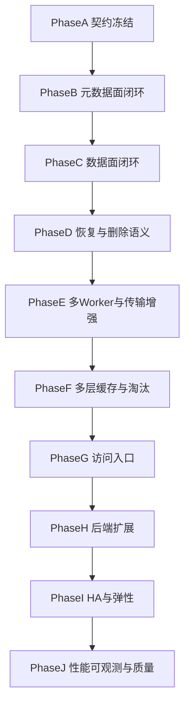

# FluxCache 开发计划（按 AI Coding 可交付性重构）

> Status: Partially superseded by implementation progress through Phase K (2026-07-23).  
> Keep as historical phase map; live status is `plan/issue-status.md`.  
> Note: cache validation is now `file_version`, not Phase-1 `mtime`.

## Goal

围绕已落地的 `Master + Worker(s) + LocalFS/S3 + write-through + file_version` 主线，按“契约冻结 → 元数据闭环 → 数据面闭环 → 恢复 → 扩展 → 生产就绪”推进；下一活跃批次见 `plan/active-batch.md`。

## 需求来源

- [README](../README.md)
- [README.zh-CN](../README.zh-CN.md)
- [Issue Roadmap](../issues/index.md)

## Steps

## 阶段定义

### Phase A：契约冻结

目标：
- 固定 `InodeId / BlockId / PageId`、配置结构、UFS 最小接口、RPC MVP 合同。
- 明确 Phase 1 只依赖 `LocalFS` 和 `mtime` 版本校验。

关键交付：
- 项目脚手架与基础测试框架。
- 配置系统。
- UFS 抽象与 LocalFS 驱动。
- 最小 RPC 契约。
- 最小 ChannelPool。

里程碑验收：
- 类型、配置、UFS、proto 都可独立编译测试。
- `FileStatus` / `FileInfo` / `ReadPages` / `WritePages` 所需字段稳定。

### Phase B：元数据面闭环

目标：
- 完成单 Master 的最小命名空间与 Worker 列表能力。

关键交付：
- Master 启动骨架。
- InodeStore / InodeTree 最小持久化。
- WorkerManager / HashRingManager 最小实现。
- MountTable 核心映射、SyncFromUfs、Unmount 安全。

里程碑验收：
- `GetHashRing`、挂载与路径解析有可观测最小行为。
- UFS 已有文件可通过同步建立 inode 关联。

### Phase C：数据面闭环

目标：
- 完成单 Worker 的读写主路径，并通过 E2E 验证。

关键交付：
- Worker 进程骨架与心跳。
- Memory tier。
- PageStore。
- Client RPC 封装与本地路由缓存。
- 分拆后的 `GetFileInfo / ReadPages / Client.Read / Read E2E`。
- 分拆后的 `CreateFile/CompleteFile / WritePages / Client.Write / Write E2E`。

里程碑验收：
- `1 master + 1 worker + 1 client` 场景下读写跑通。
- 使用 `FakeUfs` 或带计数器的测试桩验证缓存命中和回源。

### Phase D：恢复与删除语义

目标：
- 补齐 Worker 重启恢复、删除/截断后的缓存一致性。

关键交付：
- SSD/HDD tier。
- MetaStore RocksDB 恢复。
- Worker GC 与 orphan / misplaced block 对账。

里程碑验收：
- Worker 重启后页索引可恢复。
- 删除/拓扑变化后的脏缓存可被显式清理。

### Phase E：多 Worker 与传输增强

目标：
- 在核心语义稳定后增强连接池、幂等重试与多节点访问边界。

关键交付：
- ChannelPool 完整实现。

里程碑验收：
- 幂等读请求重试边界明确。
- 非幂等写请求默认不自动重试。

### Phase F：多层缓存与淘汰

目标：
- 在恢复闭环之上实现冷热分层、晋升与淘汰策略。

关键交付：
- LRU。
- 自动层级晋升与淘汰流程。
- LFU。

里程碑验收：
- 混合负载下可以观察到确定性的晋升/淘汰行为。

### Phase G：访问入口

目标：
- 提供对用户友好的访问入口，但不提前承诺尚未建模的 namespace 能力。

关键交付：
- CLI smoke 工具。
- SDK MVP。
- Client 本地 Page 缓存。
- FUSE 挂载主路径。

里程碑验收：
- SDK 只覆盖已存在服务端语义。
- FUSE 仅覆盖主路径系统调用，明确非目标。

### Phase H：后端扩展

目标：
- 扩展 UFS 类型，不改变核心协议与缓存语义。

关键交付：
- S3 UFS。
- HDFS UFS。

### Phase I：HA 与弹性

目标：
- 先通过设计收敛语义，再实现 Journal、超时、熔断与安全降级。

关键交付：
- HA Journal / Raft 设计 Spike。
- 弹性配置层。
- 安全恢复与受限降级策略。

里程碑验收：
- 不承诺 `cache-only write`。
- 不承诺“Master 不可用时通用直连 Worker”。

### Phase J：性能、可观测与质量

目标：
- 在语义稳定后推进性能优化、观测与长期质量治理。

关键交付：
- Metrics 基础导出与扩展。
- PageStore 并发优化。
- 批量 RPC / pipeline。
- 零拷贝调研与落地。
- 慢请求与热点页追踪。
- 回归测试轨道。

## 核心风险

- 版本语义风险：Phase 1 统一采用 `mtime`，Phase 2+ 再考虑 `file_version`。
- Journal 复杂度风险：先做设计 spike，后做实现，不和主线并行推进。
- 降级语义风险：所有降级策略必须保持 write-through 的正确性边界。
- 测试稳定性风险：避免依赖真实时间精度、大文件体积和外部系统抖动。

## To Confirm

- Phase 1 只限定 `LocalFS`，S3 后置到 Phase H、HDFS 后置到 Phase H。
- HA 在当前阶段先做设计，不承诺近期进入完整实现。
- SDK MVP 只覆盖文件级主路径，不提前承诺 rename / 目录修改。

## 质量门与验证动作

- 构建：`cd build && cmake --build .`
- 测试：`cd build && ctest --output-on-failure`
- Lint：对改动文件执行 lint 检查并消除新增问题。
- 失败重试：构建/测试失败最多 3 轮修复重跑；超过后输出阻塞项与风险。

## 完成定义（DoD）

- `issues/index.md`、`plan/issue-status.md`、`README*`、关键设计文档保持一致。
- 高风险大 issue 已被拆成可独立实现和验证的子 issue。
- 所有新验收标准都可通过可控测试桩或可观测断言稳定验证。

